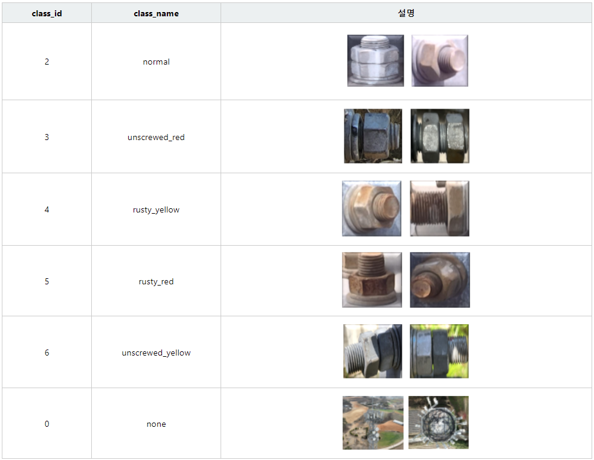

# 제2회 SK AI 경연

### Problem

The second SK AI advanced competition's goal is to find target objects (bolts and nuts) and identify its class. The target objects are in `normal`, `uncrewed_yellow`, `uncrewed_red`, `rusty_yellow`, and `rusty_red` as below[1].


### Model

We use YOLOv5[2] as an object detection architecture. We ensembed three different YOLOv5 models (yolov5m, yolov5s6, yolov5m6). Additionally, we added a classifier (ConvNext[3]+Transformer) to adjust class probabilities.

### Setup

```bash
setup.sh
```

The setup shell script is for installing packages, data preparation, and download pretrain weights.

### Train

```bash
train.sh
```

The train shell script runs train codes (YOLOv5 and the classifier).

### Prediction

```bash
submission.sh
```

The submission shell script makes a prediction `csv` file. It contains bounding box positions and its class.

### Score

The prediction score is about `mAP@[0.6]=0.7`.

### Reference

[1] https://dt-training.center/contest/technologyThema/techData/view?contestId=10&technologyThemaId=17&progressStatusCode=01  
[2] https://github.com/ultralytics/yolov5  
[3] Zhuang Liu, Hanzi Mao, Chao-Yuan Wu, Christoph Feichtenhofer, Trevor Darrell, and Saining Xie, A ConvNet for the 2020s, CVPR (2022)
